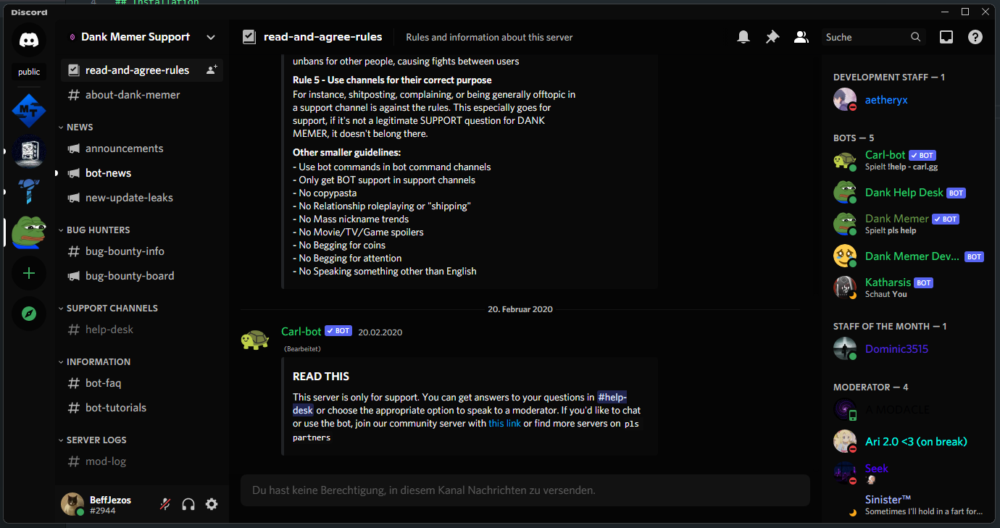

# BetterDiscord: TrueBlack
An actual Dark Theme for Discord.

## Installation 
- Open your User Settings page
- Scroll down and open the Themes Tab
- Click the Open Themes Folder Button
- Drag the TrueBlack.theme.css File into the Themes Folder
- Go back to the Themes Tab and enable the Theme

## Screenshots

